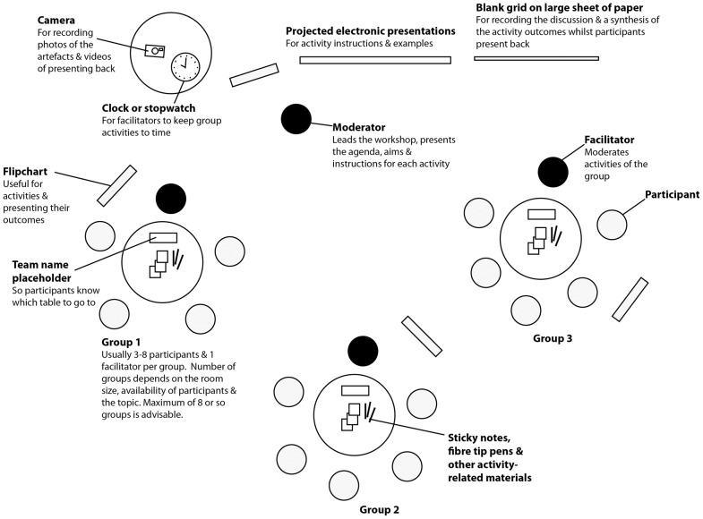

# Wie man einen Workshop vorbereitet 

[TOC]

## Vorgehensweise 1: How to design a training workshop
Reference [How to design a training workshop](https://knowhownonprofit.org/how-to/how-to-design-a-training-workshop)

1. **Draw a workshop planner**:

| Topic  | Detail  | Learning Style/Activity | Time  | Materials |
| ------ | ------- | ----------------------- | ----- | --------- |
| Topic1 | Detail1 | Activity 1              | Time1 | Material1 |
| adf    | adsf    | daf                     | dafs  | asdf      |
| dasf   | asdf    | adsf                    | adf   | asdf      |
|        |         |                         |       |           |

2. **Decide what you want your participants to learn**. By the end of the workshop, the participants will (**workshop goals**):

   1. Eine Übersicht darüber haben was 5G ist und aus welchen Technologien 5G aufgebaut ist.
   2. Welche funktionalen Verbesserungen 5G gegenüber aktueller Technologie bringt.
   3. Mindestens 3 neue Ideen wie sich 5G für die Verbesserung ihrer Arbeit einsetzen lässt ?

3. **Be clear who your audience is.** Beantworte folgende Fragen:

   1. Wer sind die Teilnehmer ?
   2. Welches Wissenslevel haben die Teilnehmer bereits zu dem Thema des Workshops ?
   3. Kennt man die Teilnehmer oder sind es Fremde ?
   4. Gibt es irgendwelche Gründe, warum die Teilnehmer gegenüber dem Workshop/Thema verschlossen sein könnten ?

4. **Bullet point three thing (per workshop goal) they need to know to reach the learning outcomes**.

   1. Workshop Ziel 1:
      1.  Zwischenziel 1
      2. Zwischenziel 2
      3. Zwischenziel 3
   2. Workshop Ziel 2
      1. ..
   3. Workshop Ziel 3
      1. …

5. **Decide how you want to teach each section**. Suggested learning styles (non-exclusive) are:

   1. *Presentation* - For introduction of a topic or communicating clear facts.
   2. *Whole group discussion* - Useful for easy questions and at the start of the session to give participants a chance to speak.
   3. *Small group discussion/exercise* - Good as follow to a presentation of a complex topic. Can be useful to help certain people to get involved together.
   4. *Pairs exercise* - When confident that everyone has a basic understanding of the topic and you have little time for an group exericse.
   5. *Individual exercise/reading* - works when participants need to think about something unique to themselves or their organisation

   *Don‘t forget to factor in time for feedback*.

6. **Add finer details**.

7. **Add timings**.

8. **List the materials you’ll need**

9. **Review**. Ask yourself

   1. Do the items in the planner “flow together” ?
   2. Do you have the right balance of learning styles ?
   3. Do the topics follow each other coherently ?
   4. Is everyone going to get a chance to speak ?

10. **Write the content.**

## Vorgehensweise 2: How to prepare a Workshop

Referenz [wikihow](https://www.wikihow.com/Prepare-a-Workshop)

1. **Part 1: Planning the workshop**
   1. **Define the objective of the workshop**.
   2. **Determine the needs of workshop participants.**
   3. **Create an outline for your workshop presentation.**
      1. Create an Introduction (Yourself, topic, participants).
      2. List skills/topics you will cover.
      3. Decide on order of topics.
      4. Determine ground rules for the workshop.
      5. Decide how you will wrap up the workshop.
   4. **Assign an estimated length of time to each item on the outline**
   5. **Once you complete your outline, practice giving your worksho presentation**
2. **Creating supporting Materials**
   1. **Prepare handouts for participants**.
   2. **Use visual tools**.
   3. **Use web-based tools, if applicable**. For example: Open source learning programs like *Moodle* or *Blackboard* can help facilitate online discussions and postings outside of the workshop setting.
3. **Encourage Workshop Participation**
   1. **Set up the room or space to encourage discussion.** For example:
      1. Arrange chairs
      2. Post ground rules
      	. Ensure blank pieces of paper, whiteboards for brainstorming	
   2. **Incoporate interactive activities into your workshop.**
   3. **Include a questions and answer portion.**
4. **Tips**:
   1. Arrive early on workshop day to set up.
   2. Create a contigency plan. For example:
      1. Low participant attendance
      2. Equipment malfunction
      3. Inaccurate time estimates for activities.

## Vorgehensweise 3: How to Run a Good Workshop

Referenz [How to Run a Good Workshop](http://scottberkun.com/2013/run-a-good-workshop/).

**Rules for running a workshop:**

1. **A 3 hour lecture is not a workshop**.
2. **The more students ouy have, the less a workshop it is.**
3. **Work the triad: explain, exercise, debrief**.
4. **Stay out of the center**.
5. **Beta test your exercises**.
6. **Macht promises to exercises.**
7. **Always have a whiteboard ora flipchart in the room.**
8. **The room should look like a workshop when you are done**
9. **Build a workshop checklist.**
10. **Give participants the next thing to do after they leave.**

## Vorgehensweise 4: Planning a Workshop - Organizing and Running a Succesful Event

Referenz [Planning a Workshop](https://www.mindtools.com/pages/article/PlanningAWorkshop.htm)

**Before the workshop**

1. **Define the Goals**.
2. **Decide Who will Attend**.
3. **Choose the right location**.
4. **Create an Agenda** with:
   1. Main points
   2. Visual aids
   3. Discussions and activities
5. **Develop a Follow-up Plan**.
6. **During the workshp - Getting People involved**
7. **Overall Workshop Tips**:
   1. If you plan the meeting, you want to facilitate it. Lear how to facilitate: [Facilitator Role description](https://www.mindtools.com/pages/article/RoleofAFacilitator.htm).
   2. Establish the objective of your meeting.
   3. Start the meeting with a few [icebreakers](https://www.mindtools.com/pages/article/newLDR_76.htm)
   4. Get the participants comfortable.
   5. Identify which section of the session which participant has to be involved.
   6. If possible avoid holding the workshop after lunch between 2:00 and 3:00.
   7. If your workshops goal is to make a decision, more attendees will it make less likely to reach one.

## Vorgehensweise 5: Ten Simple Rules for Running Interactive Workshops

Referenz [Ten Simple Rules for Running Interactive Workshops](https://www.ncbi.nlm.nih.gov/pmc/articles/PMC3937100/)

Follow the Ten simple rules which are:

1. **Decide wether an Interactive Workshop is the right choice.** Interactive Workshops are suitable for (non-exclusive):

   1. Gathering ideas for research grant proposals
   2. ascertaining user requirements for bioinformatics services
   3. generating ideas for designing web/software interfaces
   4. solving problems, such as process improvement or work strategies
   5. deciding priorities, strategy, and vision
   6. improving working relationship through team building, such as part of retreats

   Interactive workshop **may be not suitable** for:

   1. At the inception of a project when you need to identify the goals.
   2. When you have firm alternatives to evaluate.

2. **Choose participants carefully**.

   1. Describe target groups/user profiles
   2. For external participants send out “screener”.

3. **Identify Suitable Activities.**

   1. What are tangible aims of the workshop ?
   2. What specific information do you need to capture ?
   3. Tailor activities to these specific goals.
   4. Where possible use engaging activities, such as [game storming](http://gamestorming.com/) techniques. For a checklist of how to introduce an acitivity to a group see [facilitation tools](https://rhizomenetwork.files.wordpress.com/2010/12/facilitation_tools.pdf).

4. **Identify Fascilitators and Brief Them**

   1. Facilitators coordiante and assist group discussion & activities
      1. not contributing ideas
      2. not evaluating
      3. encourage input from participants
      4. keep discussions on time
      5. reminds participants to note down all their points or note them directly
      6. not need to have domain expertise, but a basic understanding is helpful
      7. 
   2. An (overseeing) moderator presents the aims, agenda, and activity instructions (see figure above)

5. **Consider Logistics, Facilities, and How to Record Outcomes**

   1. Are there flipcharts or blank pieces of paper ?
   2. Can you rearrange the tables into small groups or are there additional rooms available
   3. Is there audio-visual equipment, such as microphones for giving activity instructions ?
   4. Is there a projector for electronic presentations of the activity instructions and templates?
   5. Are there areas for circulating during breaks ?
   6. Can you arrange refreshments and/or catering ?

6. **Plan the Agenda.**

   1. Where possible use [visual agendas](http://gamestorming.com/visual-agenda/), because they set the participants expectation of the day and prepare them for the interactive nature of the workshop

7. **Market Your Interactive Workshop As a Networking Opportunity.**

8. **Get the Best from Your Participants.**

9. **Follow Up with Your Facilitators and Create a Post-Workshop Report**

10. **Follow Up with Your Participants**

## Vorgehensweise 6: How to Plan a Workshop

Referenz [How to Plan a Workshop](http://adaptivepath.org/ideas/how-to-plan-a-workshop/)

Follow this basic structure:

1. **Determine the goal of the workshop.**
2. **Write up a Workshop One Sheet.**
   1. [Example](http://adaptivepath.org/uploads/archive/blog/wp-content/uploads/2010/11/workshop1sheet.pdf)
   2. 
3. **Schedule it all out.**
4. **Don’t try to do too much.**
5. **Staff appropirately.**
6. **Know it’s going to change.**

## Referenzen

[19 Free and Open Source LMSs for Corporate Training](https://blog.capterra.com/top-8-freeopen-source-lmss/)

