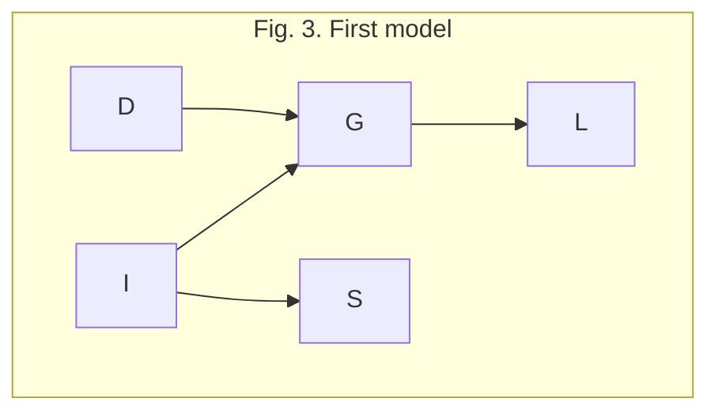
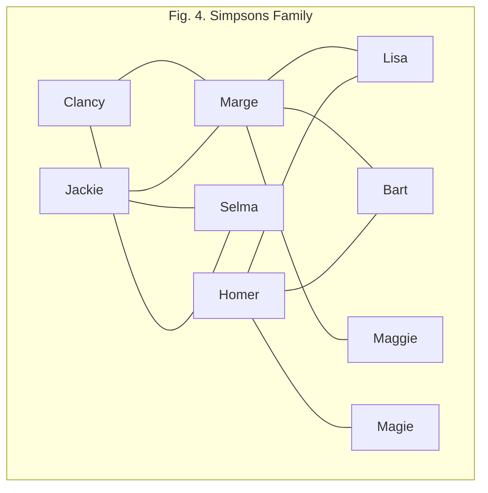

# Probabilistic Graphical Model

[TOC]


## Notes 

Probabilistic Graphical Models = PGM

10-15 hours per week for this class

## Week 1

What will I learn ?

- Learn fundamental methods
- Real worl application
- How to use this methods in your work

### Introduction and Overview

#### Overview and Motivation

PGM useful for:

- Medical Diagnosis
  - __Determining  treatment outcomes__  based on factors like:
    - predisposing factors
    - symptoms
    - test results
    - diseases
  - __Image segmentation__
    - Input millons of pixel
    - Output: Which pixel corresponds to which obejects in the real world
  - __Textual Information Extraction (NER)__
  - __Biological Network Reconstruction__

Commonality

- Large number of variables (predisposing factors, labels of reald world objects)
- Significant uncertainty of the output

Probabilistic Graphical Models (__PGM__):

- __M__odels - Declarative represantation of understand of the world (in the computer)(What are the variables, how do they interact)

  - declarative - representation stands on his own. Independent of algorithm. Vorteile deklarativer Modelle:
    - Problems can be attack with different algorithms
    - Separate out construction of the models from solution/algorithm(let domain experts or data construtct
- __P__robabilistic-Uncertainty

  - Partial knowledge of the state of the world
  - Noisy observation
  - Phenomena not covered by a model
  - Inherent stochasticity (quantum)
    Prob
- __G__raphical - Complex systems 
  - Graphs of computerscience

  - Gives

    - Intuitve & compact data structure
    - Efficient reasoning using general purpose algorithms
    - Sparse parametrization. Feasible elicitation, learning from data

  - Example: Bayesian Network - Directed Graph - Random variables = nodes - probabilistic connection - edges. Grade of a student dependent on Difficulty of the course and Intelligence of the student.

    ```mermaid
     graph TD;
     subgraph Fig. 1. Abstract Bayesian network
     Difficulty-->Grade;
     Grade-->Letter;
     Intelligence-->Grade;
     Intelligence-->SAT;
     end
    ```

  - Example: Markov Network - indirected graph. 

    ```mermaid
    graph TD;
    subgraph Fig 2. Abstr. Markovian net.
    A --- B;
    A --- D;
    D --- C;
    B --- C;
    end
    ```

  - Real World example: [CPCS](tba),

What Probability theory can offer:

- Declarative representation with clear semantics
- Powerful reasoning patterns (conditioning, decision-making)
- Established learning methods (statistical learning)

Over on contents of the course

- Representation
  - Temporal and plate modesl
  - Directed and undirected
- Inference (reasoning)
  - Exact and approximate
  - Decision making
- Learning
  - Parameters and structure
  - With and without complete data

#### Distributions

__Joint__ Distribution example

- Intelligence (I)(i^0^=low, i^1^=high)
- Difficulty (D)(d^0^=easy, d^1^ = hard)
- Grade(G)(g^1^ = A , g^2^=B, g^3^ = C)

| I    | D    | G    | Prob.        |
| ---- | ---- | ---- | ------------ |
| i^0^ | d^0^ | g^1^ | 0.126        |
| i^0^ | d^0^ | g^2^ | 0.168        |
| …    | …    | …    | …            |
| –    | –    | –    | $\Sigma = 1$ |
|      |      |      |              |

__Condition__ on g^1^:

- *Reduce* above table to rows which contain G = g^1^ 
- *Normalize* by $\sum_{i,d} P(i,d, g^1)$

__Marginalization__ of I

-  d -> $\sum_{i} P(i,d)$

  

#### Factors 

Formal: 

- A Factor of random variables $X_1,..., X_k$ is a function $\phi: Image(X_1,..., X_k) \rightarrow \mathbb{R}$
- The (set of) random variables $X_1,...,X_n$ are called the scope of the factor.

Examples:

- Joint Distribution

- Unnormalized Measure (Reduction without normalization)

- Conditional probability distribution (__CPD__)

- General factors (not directly related to a probability distribution). Just multivariable real-valued function.

Factor Product:

- For two factors $\phi_1, \phi_2$ with respective scopes $\{A,B\}, \{B,C\}$ their product $\phi_1 \star \phi_2$ is a factor of scope $\{A,B,C\}$ defined by $\phi_1 \star \phi_2 (a,b,c,d)= \phi_1(a,b) \cdot\phi_2(b,c)$

Factor Marginalization

-  Analogous to Marginalization of prob. distribution

Factor Reduction

- Analogous to Reduction of prob. distribution

__Factors are the fundamental building blocks__ for defining distributions of high-dimensional spaces.

  ### Bayesian Network Fundamentals

#### Semantics & Factorization

Runing example - student example - __P(G,D,I,S,L)__

- __G__rade
- Course __D__ifficulty
- Student __I__ntelligence
- Student __S__AT
- Reference __L__etter

`First model` the dependencies with a graph:



Next annotate each node with a separate *conditional probability distribution*:

- | d^0^ | d^1^ |
  | ---- | ---- |
  | 0.6  | 0.4  |

 - | i^0^ | i^1^ |
    | ---- | ---- |
    | 0.7  | 0.3  |

   - |            | g^1^(A) | g^2^(B) | g^3^(C) |
        | ---------- | ------- | ------- | ------- |
        | i^0^,d^0^  | 0.3     | 0.4     | 0.3     |
        | i^0^, d^1^ | 0.005   | 0.25    | 0.7    |
        | i^1^ , d^0^ | 0.9 | 0.08 | 0.02 |
        | i^1^, d^1^ | 0.5 | 0.3 | 0.2 |
        |            |         |         |         |

- Add cpd for __L__etter, __S__at

Chain rule for bayesian networks:
-  $P(D,I,G,S,L)=P(D)P(I)P(G|I,D)P(S|I)P(L|G)$

Definition __Bayesian network __(BN) is:

-  A directed acyclic Graph $G$ whose nodes represent random variables.
- For each node $X_i$ given a CPD $P(X_i|Par_G(X_i))$ (par(X)= parents of X)

With that a BN rep resents a joint distribution via the chain rule for Bayesion networks:$P(X_1,...,X_k)=\prod_i P(X_i|Par_G(X_i))$

Definition __P factorizes over G__:

- For a Graph G with nodes/random variables $X_1,..,X_n$ we say that a probability measure P __factorizes over__ G iff $P(X_1,...,X_n)= \prod_i P(X_i|Par_G(X_i))$

Example: Genetic inheritance



#### Reasoning Patterns

#### Flow of Probabilistic Influence

We reference our first model.  When can X influence Y ?

- [x] X -> Y 
- [x] X <- Y
- [x] X -> W -> Y
- [x] X <- W <- Y
- [x] X <\- W -> Y
- [ ] X-> W <-Y (*V-structure*)

Definition __Active Trail__ (without activation):

-  A path $X_1$-…-$X_n$ ist __active__ iff it has no *v-structure* $X_{i-1}$->$X_i$<-$X_{i+1}$.

When can a variable X influence a variable Y given an observations Z = $\{Z_1,..., Z_k\}$ ?

|                | Dependency |      |             |             |              |                                                             |
| -------------- | ---------- | ---- | ----------- | ----------- | ------------ | ----------------------------------------------------------- |
|                | X -> Y     | X<-Y | X -> W -> Y | X <- W <- Y | X <\- W -> Y | X-> W <-Y                                                   |
| $W \in Z$      | x          | x    | [ ]         | [ ]         | [ ]          | [x]                                                         |
| $W \not \in Z$ | [x]        | [x]  | [x]         | [x]         | [x]          | [ ] if W and all its descendants are not observed; else [x] |


Definition __Active Trail__ (with activation):

- A path $X_1,...,X_k$ given a set a observation $Z = \{Z_1,...,Z_i\}$ iff
  - For any *V-structure* $X_{i-1}$ -> $X_{i}$ <-$X_{i+1}$ there is a $X_l \in Z $ for an $l \geq i$ and
  - For every $X_m$ not part of a *V-structure* hold $ X_m \not \in Z$


#### Bayesian Networks: Independencies

Independencies:

- Two events are independent (under a prob. measure P), written $P \vDash \alpha \bot \beta$, iff (equivalently):
  -  $P(\alpha \cap \beta)=P(\alpha)P(\beta)$
  - $P(\alpha | \beta) = P(\alpha)$
- For two random variables $X, Y$ they are independent under $P$, written $P \vdash X \bot Y$, iff (equivalently):
  - $P(X,Y) = P(X)P(Y)$
  - $P(X|Y) = P(X)$

Conditional Independencies:

-  For three random variables $X,Y,Z$ the two $X, Y$ are independent given observation $Z$, written $P \vdash (X,Y | Z)$, iff (equivalently)$:
  - $P(X,Y | Z) = P(X|Z)P(Y|Z)$
  - $P(X|Y,Z)= P(X|Z)$
  - $P(X,Y,Z) \propto \phi_1(X,Z)\phi_2(Y,Z)$; which means that the lefthand side is proportional to a product of two factors $\phi_{1/2}$ with scopes $X,Z$ and $Y,Z$.


